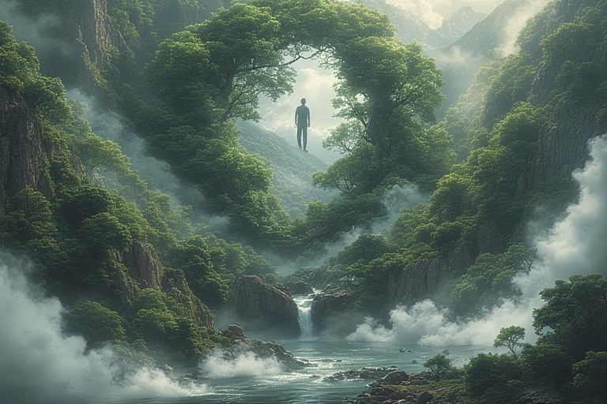
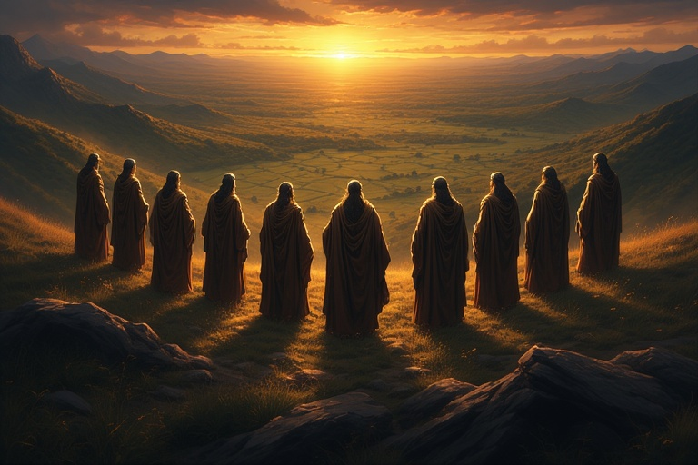
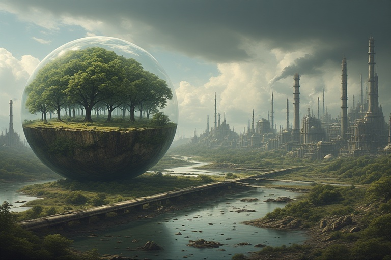
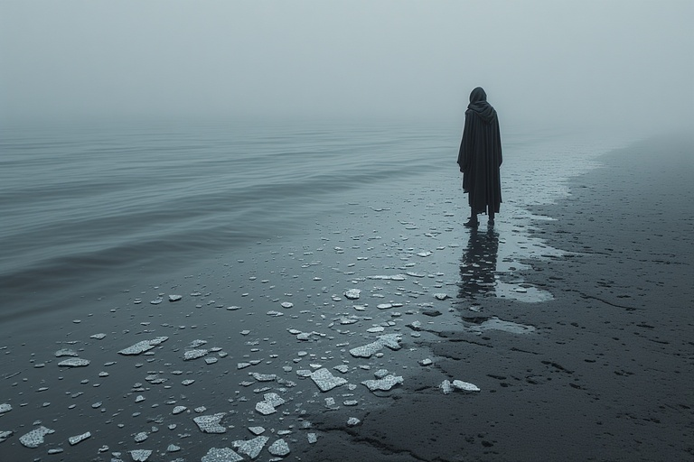
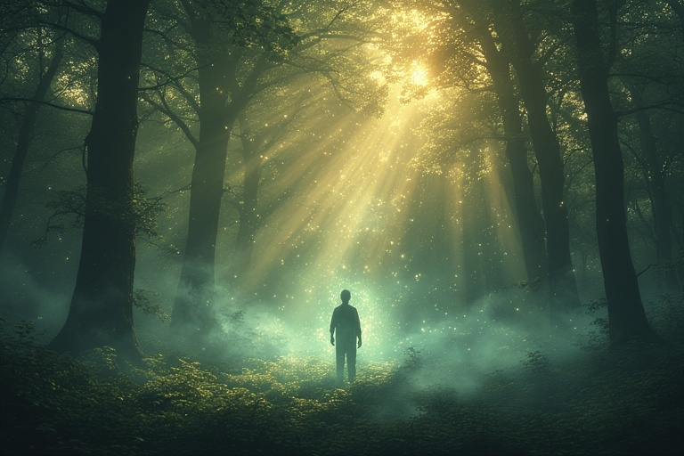

# 👁️ The Story of Disconnection

<figure><figcaption></figcaption></figure>

In the beginning, man entered the “spacesuit” of the body, yet he remained connected to his true self. He could still see his own essence reflected back to him in nature. The trees, the rivers, the sky, all of it was a crystal-clear mirror of his being.

<figure><figcaption></figcaption></figure>

In those times, rulers and kings still remembered this truth. They did not speak as “I” but as we, for they knew they were not separate individuals but part of the indivisible life.

<figure><figcaption></figcaption></figure>

But gradually, man began to forget. The past started to build up inside his body, memories, impressions, unresolved desires. This accumulation trapped him in time, and he lost the ability to withdraw into his true self. The mirror of nature grew dim.

<figure><figcaption></figcaption></figure>

Instead of recognising himself in nature, man began projecting his intelligence outward. He saw nature as something separate, something to be explained, studied, and controlled. And so two natures emerged: nature and human nature.

<figure><figcaption></figcaption></figure>

Human nature imposed itself on the earth, transforming the living world into what we now call “the environment.” What was once the pure reflection of truth became an object of use, a backdrop to man’s pursuits.

<figure><figcaption></figcaption></figure>

And so, man lost his connection. He could no longer recognise his essence in the wind, the sea, the forest. The truth of life was still there, but only in fragments, glimpses, facts, fleeting reflections. The original wholeness was forgotten.

<figure><figcaption></figcaption></figure>

We have been fragmented from the source for a long time. The density, the pain and the separation that happened on this planet were not originally intended. The human race was plunged into deep suffering and separation. It was not meant to happen in the way it happened. We were never meant to be separated from our source.

<figure><figcaption></figcaption></figure>

So let’s ascend, get out of the wheel of reincarnation in the physical world and from the enslavement of the unseen forces. Let's move into our self-sovereign divinity. Out of suffering and blindness from knowing who we really are.&#x20;
