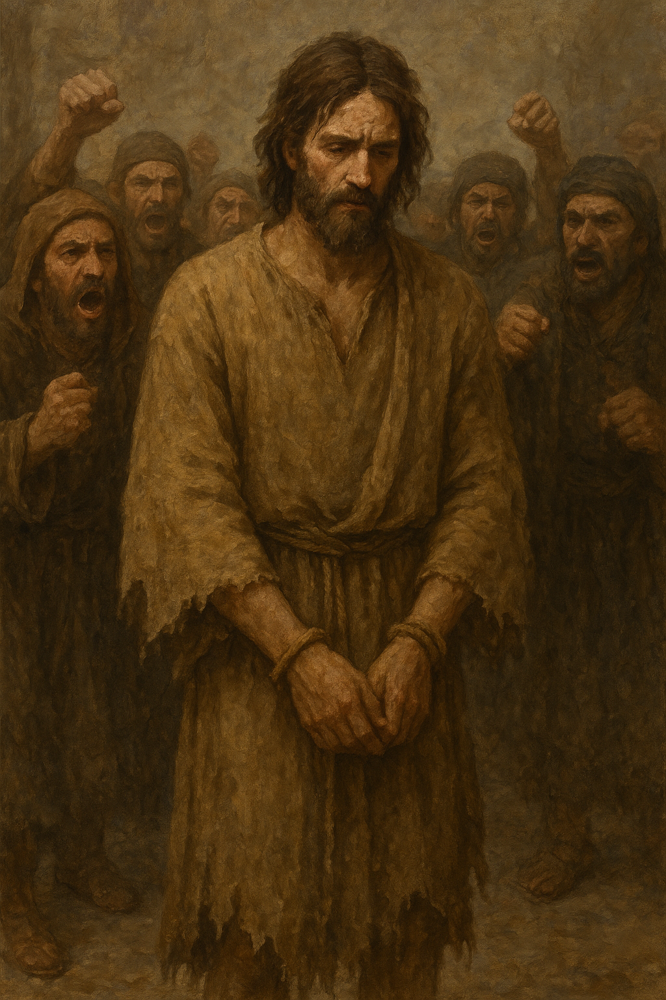

# 💩 Journey Zero: The Walk of Shame

<figure><figcaption></figcaption></figure>

#### Introduction

Every journey must begin somewhere, and this one begins in the world we have made. Before we can enter the forests, before we can meet the trees, we must first walk through the human world and see it for what it has become. This is the first step.

#### The First Invitation: To Walk and to Notice

Step outside. Walk among people. This first invitation is not to do anything, but simply to Notice. With your senses and your feeling-body open, become aware of the unseen environment.

* **Notice the Noise**: Listen beyond the sounds of traffic and voices. Can you sense the invisible hum of the streets, the frequency of a place?
* **Notice the Energy**: Feel the fields of energy that permeate populated spaces. The weight of anxiety, the sharp frequency of lust, the cold grip of fear, the bitterness of envy, the fog of confusion. These are not just emotions inside people; they are atmospheres you walk through.
* **Notice the Impact**: Pay attention to how a gaze feels. A glance that carries judgment, desire, or anger leaves a trace. A crowd is not just a collection of bodies; it is a wave of thought and emotion that can wash over you. Understand that what we call the "evil eye" is often just this: the impact of another’s un-clean intention entering an unguarded energy field.

#### The Second Invitation: To Feel and to Recognise

As you walk, turn your awareness inward. Notice your own body's response to this environment. This is a walk of recognition, seeing with honesty how this world affects you.

* **Meet Your Anxiety**: As you move through these fields of energy, specifically invite yourself to notice the feeling of anxiety within your own body. Where does it make its home in you? Is it a knot in your stomach? A frantic buzzing in your mind? A cold dread that seeps into your bones? Recognize this anxiety not as a personal failing, but as an honest and intelligent response from your body to an unhealthy environment. It is a compass needle spinning wildly, telling you that you are in a place of disharmony.
* **Feel Your Body's Armour**: Notice how your breath changes when you are in a crowd, does it become shallow? Feel your shoulders, do they tense up, creating a shield? Feel your heart, does it contract or close down to protect itself?
* **Feel the Estrangement**: Acknowledge any feelings of sadness or grief that arise. This is what your text calls a "walk of shame", not as a punishment, but as a clear and honest recognition of how things are, of how far our collective world has strayed from innocence and natural harmony.

Do not resist these feelings. Do not build a wall against them. For this first journey, your only task is to see and to feel what is truly there.

#### The Third Invitation: To Forgive and to Release

After a period of walking and witnessing, find a quiet place, perhaps under a tree, to stand or sit for a moment. Having seen the wounds of the world and felt their echo in yourself, the final act of this journey is forgiveness.

So, forgive.

Forgive the people for their unconsciousness. Forgive the noise. Forgive the wounds they carry and project.

And most importantly, forgive yourself for being affected by it all. Forgive your body for its anxiety, for tensing up, for closing down. It was only trying to protect you. Let this act of forgiveness be a conscious release of the tension you have just witnessed.

#### The Path Forward

You have taken the first, most difficult step. You have walked through the human world with open eyes and felt its weight, the noise, the anxiety, the cage.

Now that you have seen it, know that this is not your destination. This is the "before" picture.

This first journey was about recognizing the prison. The journeys that follow are about how to become free. We now turn toward the places that heal. We go to the natural world to find the love, joy, and quiet wholeness we lost somewhere on these streets growing up. We go to become so spiritually grounded, so filled with kindness and gratitude, that these qualities become a shield.

The ultimate goal is to one day walk through this same human world, not as a victim of its noise, but as a free spirit radiating your own peace. To be the one calm note in the chaos.

When you are ready, the next Journey awaits. We are going to learn how to meet the environment that heals.
