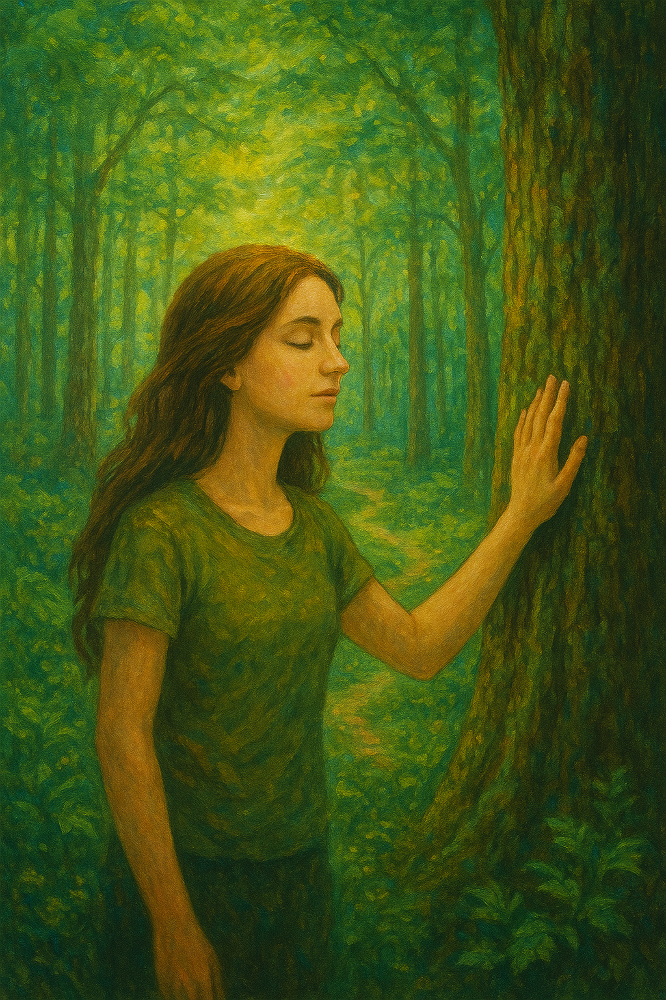

# 🚶 Journey 2: Sensory Forest Bathing

<figure><figcaption></figcaption></figure>

### Introduction

This practice is the simple and profound art of immersing yourself in a natural environment through your senses. It is not about hiking or exercise; it is about slowing down, unplugging, and allowing yourself to be fully present with the life of the forest. The goal is to receive the calming and healing atmosphere of the natural world.

This guide is designed to help you learn the basics of how to consciously interact with the forest. It outlines a complete and powerful path, but it is not a rigid set of rules. Instead, think of these invitations, Listening, Movement, Stillness, as a set of pointers for your upcoming journeys. Use them as and when you feel the call. You can explore a single practice each time you go out, or flow through the entire sequence when you have more time. The most important thing is to begin building your own personal practice of connection.

#### Principle

Before we begin, I want to share the principle that this journey is based on.

Nature is not separate from consciousness.\
Nature is the visible expression of source consciousness.\
The same intelligence that moves stars, seasons, and growth moves through trees, water, earth, and air.

That intelligence carries light.

Light here does not mean brightness.\
It means creative power, coherence, life force, awareness.

When we enter nature with presence, we place ourselves in direct contact with that flow.\
And something very specific begins to happen.

The more you open yourself to nature, the more light you allow in.\
As more light moves through you, your capacity to receive light increases.\
And as your capacity increases, even more light can flow.

This creates a natural spiral.\
Receiving light expands your ability to receive.\
Expansion allows deeper reception.\
And the process continues on its own, without effort.

This journey is designed to support that spiral.

At first, the connection may feel physical or emotional, grounding, calm, clarity, relief.\
As the journey deepens, perception begins to shift.\
You may start to sense awareness beyond form.\
Beyond the tree as an object.\
Beyond yourself as a separate body.

That recognition, awareness meeting awareness, is what many traditions call divinity.\
Not as belief, but as direct experience.

Along the way, psychological and spiritual benefits naturally arise:\
greater stability, openness, clarity, and integration.\
But these are not the goal.

The real purpose of this journey is alignment.\
As alignment deepens, the journey itself becomes the reward.

Nothing needs to be forced.\
Nothing needs to be achieved.\
We are simply creating the conditions for light to move more freely.

And from there, the process knows how to continue.

#### Rest

Before we do anything, we rest.

Rest here means relaxing effort.\
You do not need to improve anything or reach any state.

Allow your body to stop holding itself unnecessarily.\
Let the shoulders drop.\
Let the jaw loosen.\
Let the breath settle into its natural rhythm.

Do not control the breath.\
Just notice it.

If thoughts arise, let them pass.\
No engagement is needed.

Feel the weight of your body.\
Feel gravity supporting you.\
The ground is already doing the work.

This is an important principle of the journey:\
Relax and let go. Everything will come to you.

You do not need to reach for light.\
When the body and mind soften, light enters naturally.

We rest to step out of effort, tension, and social alertness.\
We rest to leave the world of constant doing.

Stay here for a few moments.\
Let the nervous system settle.\
Let presence arrive on its own.

Rest is the foundation.\
From rest, awareness becomes clear.

#### Presence

Presence is the faculty of thoughtless awareness. It is the state of being.\
It is thoughtless, timeless, and non-reactive awareness.\
It is not thinking, visualizing, or concentrating.\
It is awareness without mental commentary.

In presence, there is no analysis, no memory, no anticipation.\
There is only direct experience, as it is, right now.

Presence is not something you do.\
It is what remains when you stop doing.

This distinction matters because presence is what deepens during the journey.\
Practices do not deepen on their own; presence does.

As the journey continues, what changes is not the content of experience, but the stability of presence itself.\
The more presence is recognized, the more naturally it expands and becomes continuous.

#### Intention

Set a simple intention for this journey.

The intention is to learn how to connect with trees and nature,\
to feel more grounded, more present, and more positive.

You are not trying to fix anything.\
You are not trying to achieve a special state.

You are simply opening yourself to receive.\
\
Let this intention be light, not forced.\
Hold it gently, and then allow the journey to unfold.

#### Preparation Practices (Before the Walk)

• **Bioenergetic Grounding Exercise** (_5 minutes_)\
Connecting to earth and sky

• **Clearing Energy Channels** (_5 minutes_)\
Opening your energy channels

• **Laughter Practice** (_5 minutes_)\
Open the heart and let the spirit flow

### Invitations

#### 1. The Invitation of Listening

**Purpose**: To open the senses and expand awareness beyond the self, creating a "sound map" of the forest.\
**Script**: "_Let's begin by awakening our sense of hearing. Find a comfortable spot to stand or sit for a few moments. Close your eyes if you feel comfortable... Now, simply listen. Notice the sounds that are farthest away from you... the whisper of the wind, a distant bird... Now, bring your awareness closer. What can you hear within a few feet of you? The rustle of a leaf, the hum of an insect... Finally, bring your awareness to the sounds within your own body. The rhythm of your breath, the beat of your heart... There is no need to label or judge. Just receive. You are at the center of this symphony of life._"

#### 2. The Invitation of Smell

**Purpose**: To draw awareness into the more subtle, atmospheric qualities of the forest. \
**Script**: "_As we begin to walk slowly, let's invite in the sense of smell. As you move, notice the changing aromas in the air. What is the scent of the earth beneath your feet? Can you smell the dampness, the soil, the decay that fuels new life?... Gently take a leaf or a pine needle or moss or anything that you want to smell. Crush it softly between your fingers and bring it to your nose. What does it offer? This is the breath of the forest. Allow it to enter you._"

#### **3. The Invitation of Integrated Movement**

**Purpose**: To dissolve the sense of a separate self by synchronizing one's movement with the quiet, deliberate presence of the forest.

**Script**: "_Now that we have begun to open our senses, let's explore our place here through mindful movement. For the next few moments, I invite you to move as if you were a part of the forest itself. Imagine you are a fox stepping silently, or the mist drifting between the trees. Move with a deliberate slowness. Notice how your feet can touch the earth without a sound, how your body can weave between the trees without disturbing a single branch. Feel yourself becoming part of the seamless life of this place, belonging here completely. This is the path of moving so mindfully that the line between you and the forest begins to dissolve._"

(Allow several minutes for this practice.)

#### **4. The Invitation of Expressive Movement**

**Purpose**: To unleash and express the creative life force (the "light" you spoke of) that has been cultivated through the journey so far.

**Script**: "_From this place of deep connection, we now invite in a different energy. You have felt the quiet life of the forest; now, feel that same life force bubbling up within you. Find a space that feels safe and open to you. I invite you to express this energy through free movement. Let go of what it 'should' look like. This is an invitation to reconnect with the untamed joy that lives within you and within this wild place. You might run, leap, stretch, or spin. Let your body celebrate the feeling of being alive! This is not a performance; it is a direct expression of the 'light', the creative power that moves through all things, including you. Let it flow._"

(Allow a few minutes, gently guide them back.)

**Transitioning out**: "Gently, slowly, allow your movement to come to a rest. Stand or sit for a moment. Feel the aliveness in your body, the warmth, the tingle, the vibrant energy. Take a deep breath, and as you exhale, offer gratitude for this expression of life."

#### 5. The Invitation of Touch

**Purpose**: To create a direct, physical, and grounding connection with the elements of the forest.\
**Script**: "_Now, let's explore this place through touch. As you walk, let your hands be curious. Feel the rough, wise bark of an old tree... Feel the cool, smooth surface of a stone... Trace the delicate veins of a leaf... You are not just touching the forest; the forest is touching you back. Feel the sensation of the air on your skin, the support of the ground beneath your feet. This is a conversation without words._"

#### 6. Relational Presence: The Tree

**Purpose**: To practice the core principle of your journey: "awareness meeting awareness" with a single living being.\
**Script**: "_Find a tree that calls to you. It doesn't need to be the biggest or oldest; just one you feel a connection with. Spend some time with it. First, just look at it. See its shape, its texture, the way its branches reach for the light... Now, if you feel comfortable, place a hand on its trunk. Feel its stillness, its strength. This tree is a living expression of the same intelligence that moves through you. It is breathing, growing, being. Can you sense its presence, its awareness beyond its physical form? Rest here. There is nothing to do but be present with this other being. Awareness meeting awareness._"

_**Do the "The Tree of Awareness" meditation here.**_

#### 7. The Invitation of Stillness

**Purpose**: To integrate the experiences and rest in the state of expanded presence. \
**Script**: "_Find a comfortable place to sit for a longer period. Let go of all the invitations. Let go of all doing. We are simply returning to the principle of Rest. Sit in stillness and simply be part of the forest. You are breathing with it, held by it. Notice what is present for you now. Any feelings, any sensations, any shifts in your awareness. Allow everything to be as it is. You are resting in the heart of nature._"

### The Closing: Bringing the Journey Home

Script: "_As we gently bring our practice to a close, we will take a few moments to honor the journey we have shared—with the forest, with ourselves, and with each other. This closing allows us to gather the gifts of our time here, so we may carry them with us._"

#### Stage 1. The Tea Ceremony: An Invitation of Taste

**Purpose**: To internalise the essence of the forest and ground the experience within the body through the final sense: taste.&#x20;

**Script**: "_I now invite you to join me in a simple tea ceremony. (Pour the tea for participants). This tea, whether made from plants of this forest or brought here by us, carries warmth and life. Before you drink, take a moment to hold the warm cup in your hands. Feel its heat. See its color. Bring it to your nose and inhale its scent. Now, take your first sip slowly. As you taste it, imagine you are tasting the essence of our journey, the peace, the connection, the aliveness. With each sip, feel that nourishment spreading through your body, a final gift from the forest to you._"

#### 2. The Sharing Circle: An Invitation of Voice

**Purpose**: To give voice to the experience in a simple, non-analytical way, fostering a sense of shared humanity and witnessing.&#x20;

**Script**: "_We have shared this space in beautiful silence. Now, we create a space to share our voice. I invite you, if you feel comfortable, to offer just one word or a short phrase that has arisen for you during our journey. This is not for discussion or analysis, but simply an offering to the circle. A simple gift of your experience. I will begin..." (Examples: "Deeply calm," "Vibrant," "Connected," "Grateful," "Light.")_

#### 3. The Final Gratitude: An Invitation of Acknowledgement

**Purpose**: To formally conclude the practice by offering reverence and thanks, sealing the experience and honouring the relationship that has been deepened.&#x20;

**Script**: "_To close our circle, let us offer our gratitude. First, to the forest itself. To the trees, the earth, the air, and all the beings who have held us and shared their wisdom with us today. Thank you. ...Next, turn your gratitude inward. Thank yourself for giving yourself this time, for showing up with openness and presence. Thank you. ...Finally, to each other. Thank you for sharing this journey, for holding this quiet, sacred space together. The journey is complete. May you carry the peace of the forest with you._"
