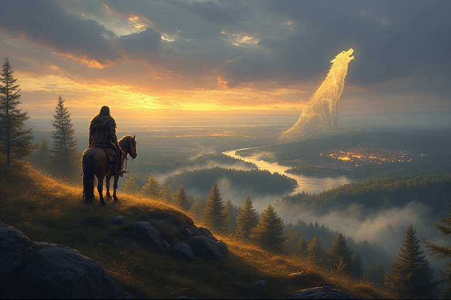

# 🌆 S: Origin of the city

<figure><figcaption></figcaption></figure>

According to the tale:

Gediminas, the Grand Duke of Lithuania in the 14th century, went hunting in the valley where the Vilnia and Neris rivers meet.

After the hunt, he camped there overnight.

In his dream, he saw a huge iron wolf standing on a hill and howling with the strength of a hundred wolves.

Troubled, Gediminas asked the pagan priest and oracle Lizdeika to interpret it.

Lizdeika told him that the iron wolf symbolised a strong and enduring city that would be built on that spot, a city whose fame would spread across the world, just like the wolf’s powerful howl.

Gediminas took the vision as a divine sign and ordered the foundation of Vilnius there, which became the capital of the Grand Duchy of Lithuania.

## The Birth of the Project

_From Curiosity to Practice:_

The next weekend, I returned to the Hill of Three Crosses to learn more. There I found Vilnelė again. After Akvilė had told me the fuller story of Gediminas and Lizdeika, my curiosity deepened. I discovered that Vilnius is one of the greenest capitals in Europe, full of old, living trees, and that fact stayed with me.

One day at the gym, the idea came into focus: monks and ascetics used to sit beneath trees; perhaps I could re-activate similar practices here. I began thinking about merging and blending energies with trees as part of a disciplined practice for presence and inner work. As I held that idea, my energy rose. I slipped into a clear, present, high-vibrational state and felt certain I had found something substantial.

I began to experiment. The trees started to answer. Some called to me; more and more trees opened a conversation. People told me where the old, respected trees were located. I sat with them, blended my energy with theirs, took their help, offered gifts, and practised energetic exchange. The results were profound: my health and clarity returned, my practice deepened, and the trees became teachers, allies, and co-creators.

This sustained, embodied practice, a discipline of meeting, blending, and learning from trees, is the seed of the project. From these encounters, I developed the core method behind Being with Trees: a distinction-based, experiential pathway for energetic forest immersion.&#x20;

_Later, as my relationship with the trees matured, the folklore of origins, the Eglė (Queen of Serpents) story of the five trees and their meaning, arrived as a cultural and mythic frame that grounded the practice in Baltic imagination._
