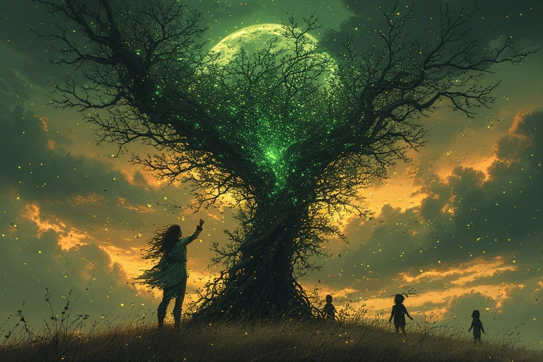

# 🌲 S: Origin of Trees

<figure><figcaption></figcaption></figure>

Three sisters were bathing by the Baltic Sea. When the youngest, Eglė, came out of the water, she found a serpent curled in her clothes. The serpent would not leave unless she promised to marry him.

Later, serpents came to claim her. Her family resisted. They tried to deceive them, first by giving a goat, then other animals, and even objects in her place. But each time the serpents returned. At last, they took Eglė herself.

She was brought to the amber palace under the sea, where the serpent revealed his true form as Žilvinas, king of serpents. They married, and Eglė bore three sons and a daughter.

Years later, Eglė wished to visit her family. Žilvinas agreed, but only if she promised not to reveal his name or the way to summon him.

When she returned, her brothers interrogated her children to learn Žilvinas’s name. The sons refused to betray him, but the daughter, Drebulė (the trembling aspen), frightened by her uncles, revealed the secret.

The brothers went to the sea, called Žilvinas, and killed him. Before his death, Žilvinas had warned: “If the sea-foam is white, I live. If the sea-foam is red, I am dead.”

When Eglė called for him and saw red foam rising, she knew the truth. In grief and rage, she transformed herself and her children into trees:

Eglė became a spruce, her sons became oak, ash, and birch, and her daughter became the trembling aspen, whose leaves still shake with fear and guilt.

Thus, the trees in the forest are said to be the children of humans and the serpent king.

This tale, one of the most famous in Lithuania, explains not only the origins of trees but also the tragic bond between humans and the natural world.

We have some stories about the interaction of humans with nagas/ serpants, but they’re mostly positive. Nagas are proud people; people here murdered their kind. I wonder what the implications of this action were. Perhaps Curlionis knew.
